# Sports2D — Complete Description, and the Method for Validating It

**Cadence · University of Roehampton**

A full account of what Sports2D computes and how, read from the installed source rather than its
documentation; followed by the method for comparing its output against marker-based motion capture.

| | |
|---|---|
| **Application** | Cadence (Dash viewer) |
| **Engine** | Sports2D 0.8.32 · Pose2Sim 0.10.47 |
| **Pose model** | `Body_with_feet` (HALPE-26 → 22 emitted keypoints) |
| **Reference system** | Vicon (marker-based) |
| **Movement of interest** | Overground running |

---

## Cadence

Cadence is a web application (Python / Dash) built at the University of Roehampton. It loads the angle file Sports2D produces (an OpenSim `.mot`) and renders it: joint and segment angles over time, a data table, and running cadence in steps per minute.


The purpose of validation is to produce a **per-joint statement of confidence**.

## Sports2D

[Sports2D](https://github.com/davidpagnon/Sports2D) computes 2D human pose and joint angles from a single video. It is used here as an unmodified
dependency. Under the default configuration, a frame passes through:

1. **Pose estimation.** An RTMPose model (`Body_with_feet`, `mode = 'balanced'`) locates anatomical
   landmarks, returning positions **in image coordinates** — pixels, not millimetres. These are
   *estimates inferred from appearance*; there is no physical marker on the body.
2. **Confidence gating.** Keypoints below a score threshold are discarded; persons with too few
   surviving keypoints are dropped entirely.
3. **Facing-direction flip.** The subject's facing side is inferred and the x-axis negated if they
   face left (§8).
4. **Angle computation.** Joint and segment angles are derived geometrically from the (possibly
   flipped) landmark positions, in the plane of the image (§4–§6).
5. **Post-processing.** Outlier rejection, gap interpolation, low-pass filtering, and floor-angle
   correction of segment angles (§9).
6. **Output.** Angles to `.mot`; keypoints to `.trc` (pixels and metres) and `.c3d`. Optionally
   OpenSim scaling and inverse kinematics (`do_ik`, off by default).

Two consequences frame everything else. The angles are **two-dimensional** — they describe motion
projected onto the image plane, and implicitly assume the plane of movement is parallel to it. And
accuracy is bounded by the pose model's ability to localise a landmark it can only *infer*, which is
why camera angle, lighting, clothing and occlusion are not incidental details but the dominant error
terms (§12).

## Keypoint topology

The default model is `Body_with_feet` — HALPE-26, of which Sports2D emits **22 keypoints** (the four
eye/ear points are not written out). These are the complete set of landmarks from which every angle is
constructed.


*A kinematic tree rooted at the pelvis centre (`Hip`). Drawn as viewed facing the subject, so the
subject's **right** appears on the left. Ringed nodes are those the sagittal joint angles use.
Green = right chain, red = left chain, grey = axial / midline.*

| # | Keypoint | Anatomical meaning | # | Keypoint | Anatomical meaning |
|---:|---|---|---:|---|---|
| 1 | `Hip` | Pelvis centre (mid-hip) | 12 | `LSmallToe` | Left 5th toe |
| 2 | `RHip` | Right hip joint centre | 13 | `LHeel` | Left heel (calcaneus) |
| 3 | `RKnee` | Right knee joint centre | 14 | `Neck` | Base of neck / shoulder mid-point |
| 4 | `RAnkle` | Right ankle joint centre | 15 | `Head` | Top of head (vertex) |
| 5 | `RBigToe` | Right 1st toe | 16 | `Nose` | Nose |
| 6 | `RSmallToe` | Right 5th toe | 17 | `RShoulder` | Right shoulder joint centre |
| 7 | `RHeel` | Right heel (calcaneus) | 18 | `RElbow` | Right elbow joint centre |
| 8 | `LHip` | Left hip joint centre | 19 | `RWrist` | Right wrist joint centre |
| 9 | `LKnee` | Left knee joint centre | 20 | `LShoulder` | Left shoulder joint centre |
| 10 | `LAnkle` | Left ankle joint centre | 21 | `LElbow` | Left elbow joint centre |
| 11 | `LBigToe` | Left 1st toe | 22 | `LWrist` | Left wrist joint centre |

There is no `RIndex` / `LIndex` keypoint.

## The angle engine

Every angle is a table entry in `Pose2Sim/common.py` of the form
`[keypoints, type, offset, scaling]`, evaluated as:

```python
ang = points_to_angles(keypoints)     # depends on how many points — see below
ang = (ang + offset) * scaling
ang = (ang + 180) % 360 - 180         # wrap; pelvis & shoulders wrap to (-90, 90]
```

`points_to_angles` **changes meaning with the number of keypoints**, and this is the single most
important detail in the whole system:

| Points | Vectors formed | Meaning |
|---:|---|---|
| **2** | `u = a − b` | Orientation of `u` from horizontal — a **segment** angle |
| **3** | `u = a − b`, `v = c − b` | Signed angle between them, **around the middle point `b`** (a vertex angle) |
| **4** | `u = b − a`, `v = d − c` | Signed angle **between two free vectors** — they share no vertex |

The 2D signed angle is `−atan2(cross(u,v), dot(u,v))`; the 2-point case is `atan2(uy, ux)` directly.

Because image `y` points **downward**, the `scaling = −1` carried by every segment angle converts the
result into a conventional **y-up** frame. A segment pointing straight down therefore reads **−90°**,
straight up reads **+90°**, and horizontal-forward reads **0°**.

> **Four-point angles cannot be reproduced as a vertex angle.** Hip, shoulder and ankle are all
> four-point angles between two vectors that share no vertex. Reconstructing them as a three-point
> angle at the joint — the obvious thing to reach for — gives a different number.

## 5. The complete angle catalogue

The table defines **28 angles**. With the 22-keypoint model, **24 are produced** and **4 are
structurally impossible**. This exactly matches the 24 angle columns in the project's own `.mot`
files.

### Joint angles — 10 produced

`Neutral` is the value at an upright standing pose (facing +x, feet flat, arms at sides).

| Angle | Keypoints | Pts | Offset | Scale | Vectors compared | Neutral |
|---|---|---:|---:|---:|---|---:|
| `right ankle` | RKnee, RAnkle, RBigToe, RHeel | 4 | +90 | 1 | shank `RAnkle−RKnee` vs foot `RHeel−RBigToe` | 0° |
| `left ankle` | LKnee, LAnkle, LBigToe, LHeel | 4 | +90 | 1 | shank vs foot | 0° |
| `right knee` | RAnkle, RKnee, RHip | 3 | −180 | 1 | vertex at `RKnee` | 0° |
| `left knee` | LAnkle, LKnee, LHip | 3 | −180 | 1 | vertex at `LKnee` | 0° |
| `right hip` | RKnee, RHip, **Hip, Neck** | 4 | 0 | −1 | thigh `RHip−RKnee` vs **trunk `Neck−Hip`** | 0° |
| `left hip` | LKnee, LHip, **Hip, Neck** | 4 | 0 | −1 | thigh vs **trunk** | 0° |
| `right shoulder` | RElbow, RShoulder, **Hip, Neck** | 4 | 0 | −1 | arm `RShoulder−RElbow` vs **trunk `Neck−Hip`** | 0° |
| `left shoulder` | LElbow, LShoulder, **Hip, Neck** | 4 | 0 | −1 | arm vs **trunk** | 0° |
| `right elbow` | RWrist, RElbow, RShoulder | 3 | +180 | −1 | vertex at `RElbow` | 0° |
| `left elbow` | LWrist, LElbow, LShoulder | 3 | +180 | −1 | vertex at `LElbow` | 0° |

**Every joint angle reads 0° at neutral standing.**

### Segment angles — 14 produced

Each is the orientation of a single vector, measured anticlockwise from horizontal in a y-up frame.

| Angle | Vector (`a − b`) | Direction at neutral | Neutral |
|---|---|---|---:|
| `right foot` / `left foot` | `BigToe − Heel` | heel → toe, forward | 0° |
| `right shank` / `left shank` | `Ankle − Knee` | knee → ankle, down | **−90°** |
| `right thigh` / `left thigh` | `Knee − Hip` | hip → knee, down | **−90°** |
| `pelvis` | `LHip − RHip` | right → left | 0° |
| `trunk` | `Neck − Hip` | pelvis → neck, up | **+90°** |
| `shoulders` | `LShoulder − RShoulder` | right → left | 0° |
| `head` | `Head − Neck` | neck → vertex, up | **+90°** |
| `right arm` / `left arm` | `Elbow − Shoulder` | shoulder → elbow, down | **−90°** |
| `right forearm` / `left forearm` | `Wrist − Elbow` | elbow → wrist, down | **−90°** |

> **Segment angles are not zeroed to anatomy.** A vertical limb reads ±90°, not 0°. `pelvis` and
> `shoulders` additionally wrap to (−90°, 90°] rather than (−180°, 180°].

### The 4 that can never be produced

| Angle | Keypoints | Why it fails |
|---|---|---|
| `right wrist` | RElbow, RWrist, **RIndex** | `RIndex` does not exist in HALPE-26 |
| `left wrist` | LElbow, **LIndex**, LWrist | `LIndex` does not exist in HALPE-26 |
| `right hand` | **RIndex**, RWrist | `RIndex` does not exist in HALPE-26 |
| `left hand` | **LIndex**, LWrist | `LIndex` does not exist in HALPE-26 |

These evaluate to `NaN` for every frame and are dropped before the `.mot` is written. This is why the
files carry a `right forearm` column but no `right wrist` — a useful independent confirmation that the
topology in §3 is the one actually running.

> **An upstream inconsistency, noted in passing.** `right wrist` is ordered
> `[RElbow, RWrist, RIndex]` (vertex at the wrist) but `left wrist` is
> `[LElbow, LIndex, LWrist]` — vertex at the *index finger*. The two sides are not symmetric. Since
> both are unreachable with this pose model it has no effect on output, but it is a reason to read the
> table sceptically rather than trust it by reputation.

## 6. Where the trunk-referencing bites

Hip and shoulder flexion are both measured against the **trunk axis** (`Hip → Neck`) rather than
against the pelvis or a joint vertex. This is not a nuance; it changes what the numbers mean.

Rotating **only the trunk** about the pelvis, leaving the thigh completely untouched, using the
installed library:

| Trunk lean | `right hip` | `right shoulder` | `right knee` |
|---:|---:|---:|---:|
| 0° | 0.00° | 0.00° | 0.00° |
| 5° | **5.00°** | 0.00° | 0.00° |
| 10° | **10.00°** | 0.00° | 0.00° |
| 15° | **15.00°** | 0.00° | 0.00° |
| 20° | **20.00°** | 0.00° | 0.00° |

**Hip flexion tracks trunk lean exactly 1:1 even though the hip never moved.** (Shoulder reads 0°
throughout only because the arm was rotated rigidly *with* the trunk — which is itself the proof that
it is arm-vs-trunk, not arm-vs-vertical.)

Every runner has forward trunk lean, and it varies with speed and with fatigue. So the Sports2D hip
angle is a **compound of true hip flexion and trunk lean**, whereas Plug-in Gait's hip is
thigh-vs-pelvis. Comparing the two directly measures a *difference in definition* and mistakes it for
a difference in accuracy. This is very plausibly a large part of the systematic hip offset reported in
the published Pose2Sim validation — which would mean **the hip is less broken than the literature
implies, once compared like with like.**

### The three lower-limb angles, drawn

| Knee flexion | Hip flexion | Ankle dorsiflexion |
|---|---|---|
|  |  |  |
| 3 points, vertex at the knee | **4 points, two free vectors**: thigh vs trunk | **4 points, two free vectors**: shank vs foot |
| `θ = signed(RAnkle−RKnee, RHip−RKnee) − 180` | `θ = −signed(RHip−RKnee, Neck−Hip)` | `θ = signed(RAnkle−RKnee, RHeel−RBigToe) + 90` |

## 7. Pixels, metres, and the `.trc` files

Sports2D writes keypoints twice: `*_px_*.trc` in pixels and `*_m_*.trc` in metres. With
`to_meters = true` (the default), the conversion is scaled from the **subject's height in pixels**
against an assumed real height, with a correction for the estimated floor angle and camera geometry.

**The angles are computed from pixel coordinates and are scale-free** — an angle does not care about
the units of the points it is built from. The metre conversion matters for the `.trc`/`.c3d` and for
OpenSim, not for the `.mot`. The one exception is the floor-angle correction in §9, which is only
applied when `to_meters` is on.

## 8. The facing-direction flip

Before angles are computed, Sports2D decides which way the subject faces and negates coordinates
accordingly:

| `visible_side` | Effect |
|---|---|
| `right`, `none` | no change |
| `left` | **negate every x-coordinate** |
| `front` | negate x of all `R*` keypoints |
| `back` | negate x of all `L*` keypoints |
| `auto` *(default)* | resolved **per frame** — see below |

Under `auto`, the decision comes from the feet:

```python
global_orientation = (RBigToe.x - RHeel.x) + (LBigToe.x - LHeel.x)
visible_side = 'right' if global_orientation >= 0 else 'left'
```

That is: *are the toes ahead of the heels, or behind them?*

Three consequences:

- **Direction of travel is compensated internally.** A right-to-left run does not simply invert the
  reported angles.
- **Any reference computed from Vicon data must apply the same flip**, or every angle will differ by
  its sign.
- **It is a failure mode.** The decision is made *per frame*, from the **foot keypoints** — which are
  the least reliably localised points on the body. A misdetection inverts the sign of every angle for
  those frames. This is worth testing for explicitly rather than assuming.

## 9. From geometry to `.mot`: the post-processing chain

**The `.mot` is not raw per-frame geometry.** Under the default configuration, angles pass through:

| Stage | Default | What it does |
|---|---|---|
| Outlier rejection | `reject_outliers = true` | Hampel filter: rejects points outside a 95% CI from the median in a sliding window of 7 |
| Interpolation | `interpolate = true`<br>`interp_gap_smaller_than = 100` | Linearly interpolates gaps **shorter than 100 frames** |
| Large-gap fill | `fill_large_gaps_with = 'last_value'` | Gaps **longer** than that are filled by **holding the last value constant** |
| Low-pass filter | `filter = true`, `butterworth`<br>`cut_off = 6 Hz`, `order = 4` | Zero-phase Butterworth |
| Floor correction | `correct_segment_angles_with_floor_angle = true` | Subtracts the estimated floor angle from **every segment angle** (not joint angles); requires `to_meters` |

> **This matters for trust.** At 25 fps, `interp_gap_smaller_than = 100` permits **four seconds** of
> invented data. Anything longer is filled with a **held constant**, which renders as a perfectly flat
> line that is visually indistinguishable from a real measurement. A `.mot` can therefore contain long
> stretches of values that were never observed. Any validation must either disable interpolation or
> track which frames were synthesised.

The floor correction is also worth understanding: it is designed to remove **camera tilt** from the
segment angles. If it is the *floor* that is genuinely tilted rather than the camera, the correction
is wrong and should be turned off.

## 10. Where the documentation is wrong

Sports2D's own docstring describes its angle conventions. Compared against the source, it is
**incorrect or incomplete in five places**. These are not pedantic points: three of them would produce
wrong numbers in anyone reimplementing the angles.

| Documentation says | The source actually does | Severity |
|---|---|---|
| "**Hip flexion**: Between knee, hip, and shoulder" | 4 points — `RKnee, RHip, Hip, Neck`. Thigh vs **trunk axis**. **No shoulder keypoint is involved at all.** | **Wrong** |
| "**Shoulder flexion**: Between hip, shoulder, and elbow" | 4 points — `RElbow, RShoulder, Hip, Neck`. Arm vs **trunk axis**, not a vertex angle. `Neck` is omitted from the description. | **Wrong** |
| Segment list: foot, shank, thigh, pelvis, trunk, shoulders, arm, forearm | There is also a **`head`** segment (`Head − Neck`), which *is* written to the `.mot`. | **Incomplete** |
| "Angles are measured anticlockwise between the horizontal and the segment" | True — but it never states that a **vertical segment reads ±90°, not 0°**, nor that `pelvis`/`shoulders` wrap to (−90°, 90°]. | **Incomplete** |
| (silent) | The **x-flip**, the **floor-angle correction of segment angles**, and the fact that **wrist/hand angles are unobtainable** with the default pose model are all undocumented. | **Omitted** |

**Knee flexion, elbow flexion and ankle dorsiflexion are described substantially correctly.**

One claim that looks wrong but is not: the README says shoulder flexion is "180° when the arm is
aligned with the trunk". The phrase is ambiguous, and both readings are real — measured against the
trunk vector, the shoulder reads **0° with the arm at the side**, **90° with the arm horizontal
forward**, and **±180° with the arm overhead**. "Aligned with the trunk" in the sense of *extended
along the trunk axis* is the overhead case, and 180° is correct for it.

## 11. Comparing 2D video against Vicon

The two systems do not measure the same thing in the same space, so a valid comparison must be
constructed rather than assumed.

| | Sports2D | Vicon |
|---|---|---|
| **Source** | Landmarks inferred from a video frame | Physical markers on the skin |
| **Space** | 2D, image plane, pixels | 3D, laboratory frame, millimetres |
| **Joint centres** | Estimated directly by the pose model | Regressed from marker clusters |
| **Angle convention** | Geometric, as in §5 | Clinical / Plug-in Gait |

### Why the reference must be rebuilt, not read off

Comparing Sports2D's knee angle against Vicon's knee angle conflates two unrelated quantities: the
difference contains **both** the pose-estimation error we want **and** the definitional gap between
conventions, with no way afterwards to separate them. §6 shows exactly how large that gap can be.

The comparison is therefore built the other way round. Vicon's **3D joint-centre positions** are
projected into the sagittal plane, and the angles recomputed from those projections using
**Sports2D's own formulas from §5** — including the four-point constructions, the offsets, the
scalings, and the facing flip from §8. Both sides are then 2D angles built identically, differing only
in where the joint centres came from. **What remains is pose-estimation error and nothing else.**

This is why the comparison consumes **marker and joint-centre positions**, not computed joint angles.
Plug-in Gait angles remain useful as a secondary cross-check, but cannot be the primary reference.

### Where the two topologies do not align

| Sports2D keypoint | Vicon equivalent | Where they differ |
|---|---|---|
| `Hip` (centre) | Pelvis origin, or mid-point of the hip joint centres | Close agreement. |
| `RHip` / `LHip` | Hip joint centre (regressed from ASIS/PSIS) | The pose model places the hip nearer the greater trochanter than the regressed centre; a small offset is expected. |
| `RKnee` / `LKnee` | Knee joint centre | Close agreement. |
| `RAnkle` / `LAnkle` | Ankle joint centre | Close agreement. |
| `RHeel` / `LHeel` | `RHEE` / `LHEE` | Direct marker equivalence. |
| `RBigToe` / `LBigToe` | `RTOE` / `LTOE` | Plug-in Gait's toe marker sits on the **2nd metatarsal head**; Sports2D means the **1st toe**. This biases the ankle angle and the foot segment directly, and it also feeds the **facing-direction detector** (§8). A 1st-metatarsal marker removes the ambiguity. |
| `RShoulder` / `LShoulder` | Shoulder joint centre | Needed for shoulder flexion. |
| `Neck` | `C7`, or the shoulder mid-point | **Critical** — the trunk vector `Hip → Neck` drives both hip and shoulder flexion (§6). Not a native Plug-in Gait output; whichever is used must be recorded. |
| `Head` | Head origin from the four head markers | Sports2D means the vertex; the Plug-in Gait head origin is not the vertex. |
| `Nose`, `SmallToe`, `Elbow`, `Wrist` | — | Not used by the lower-limb angles under validation. |

### What the comparison reports

Per joint, three numbers, because a single error figure hides the distinction:

- **RMSE** — total disagreement, in degrees.
- **Mean offset (bias)** — whether the video angle sits systematically above or below the reference.
- **Waveform correlation** — whether the *shape* is right, independent of any offset.

The split matters more than the total. A joint with a **large offset but high correlation** remains
usable: the offset is a constant that can be calibrated out, and time-based measures such as cadence
are indifferent to it. A joint with **poor correlation** is untrustworthy at any offset, because the
underlying motion is not being tracked. A joint can fail one test and pass the other, and the
application's treatment of it depends on which.

## 12. Camera placement

Because Sports2D measures angles *in the image plane*, camera geometry is not a convenience — it is
part of the measurement instrument.

### Perpendicularity

Running is very nearly planar; the joints of interest swing in the sagittal plane. Sports2D's angles
are faithful to that motion only if the **image plane is parallel to the plane of motion** — the
optical axis perpendicular to the direction of travel.

Rotate the camera off that perpendicular by θ, and distances along the direction of travel are
compressed in the image by **cos θ** while vertical distances are not. Segments foreshorten unevenly
and every angle built from them distorts. The effect is **systematic, not noise** — it shifts the
whole curve rather than averaging out over strides.



*Plan view. θ is exaggerated for clarity; a few degrees are tolerable, but the error grows with the
cosine and does not average away.*

### Distance and focal length

The angle mathematics implicitly assumes an **orthographic projection** — that a segment's apparent
length does not depend on its distance from the lens. A real camera is perspective and violates this:
the near leg is closer than the far leg and renders larger.

The strength of the effect scales with subject-depth over camera-distance. A close camera with a wide
lens produces strong perspective and visibly unequal legs; a camera **well back with a longer focal
length** flattens the projection toward the orthographic ideal. In short: *stand back and zoom in*.

Perspective and lens distortion both grow toward the frame edges, so the most trustworthy part of a
pass is where the subject is **near the centre of the image**.

| Height | Framing and the two legs |
|---|---|
|  |  |
| With the lens level with the hips, the region of interest sits on the optical axis where distortion is least. A raised, tilted camera compresses vertical distances unevenly, and the lower limb suffers most. | A side-on view is **not symmetric**: the camera-side leg is nearer, larger and unoccluded; the far leg is periodically hidden behind it and rendered at a different scale. The near leg is the more trustworthy, and the two are worth validating **separately rather than pooled**. |

### Time, not just space

**Frame rate** caps the resolution of anything measured in time: a stride at 170 spm lasts ≈0.7 s, so
at 25 fps it is sampled about 17 times. **Shutter speed** is separate: a long exposure smears a
fast-moving foot across pixels, and the model cannot localise a landmark that is not sharp. Motion
blur degrades keypoints even at high frame rates.

Note also that the default **6 Hz Butterworth** (§9) sits at roughly half the Nyquist frequency of a
25 fps recording — the filter and the frame rate are not independent choices.

### What the model can see

Landmarks are inferred from appearance, so anything obscuring the body's outline degrades them.
**Close-fitting clothing** measurably improves lower-limb keypoint accuracy over loose garments, which
drape over the joint they are meant to reveal — a documented effect, not a preference. Even
illumination and a contrasting background help for the same reason: the model is finding edges.

This bears directly on §8: the **foot keypoints drive the facing-direction detector**, and they are
the ones most often occluded, blurred, or hidden by a shoe.

## 13. Synchronisation, and practical considerations

The comparison is made **frame by frame**, so video and mocap must share a clock. Without one, the
per-joint error figures — the entire object of the exercise — cannot be computed at all. Either the
camera is **genlocked/timecoded** to the capture system, or a **sharp shared event** (clap, stamp,
dropped marker) appears in both streams at the start of *every* trial. The sample rates of both
streams must be known, since one is resampled onto the other.

Open questions whose answers shape the session design:

- **Capture volume and stride count.** Overground running through a typical volume yields two or three
  strides per pass — enough to validate joint *angles*, not enough for anything rhythmic (cadence, or
  its drift). Whether a treadmill fits inside the volume changes what is answerable.
- **Direction of travel**, recorded per trial, so the flip in §8 is checkable rather than assumed.
- **Available frame rates** for both mocap and video, and whether they can be hardware-synchronised.
- **Marker set** — upper body is required (the trunk vector drives hip *and* shoulder), and a
  1st-metatarsal marker resolves the toe ambiguity.
- **Ethics and consent** for retaining identifiable video alongside marker data.

## 14. Appendix: how the claims in this document were verified

Nothing in §2–§10 is quoted from the Sports2D documentation. Each claim was checked against the
installed library (Sports2D 0.8.32, Pose2Sim 0.10.47) as follows.

| Claim | How it was verified |
|---|---|
| The angle algorithm (§4) | The algorithm as written here was **reimplemented from scratch** and fuzz-tested against `Pose2Sim.common.fixed_angles` on **2,000 random poses for each of all 28 angle definitions**. All 28 matched to within 1e-9. |
| 24 angles produced, 4 blocked (§5) | Derived from the keypoint set, then **cross-checked against the 24 angle columns in the project's own `.mot` file**. Exact match, no discrepancies in either direction. |
| Neutral-standing values (§5) | Each of the 24 evaluated on a constructed upright standing pose. |
| Trunk-referencing of hip/shoulder (§6) | The installed library was driven with a pose in which **only the trunk was rotated** about the pelvis. Hip flexion tracked the lean 1:1 (20° → 20.00°) with the thigh unmoved. |
| The facing-direction flip (§8) | Read from `Sports2D/process.py`, `compute_angles_for_person`. |
| Post-processing defaults (§9) | Read from the shipped `Config_demo.toml` and the application sites in `process.py`. |
| Documentation discrepancies (§10) | The docstring in the installed `Sports2D/Sports2D.py` compared line by line against `angle_dict`. |

**Source locations:** `Pose2Sim/common.py` — `angle_dict`, `points_to_angles`, `fixed_angles`.
`Sports2D/process.py` — `compute_angle`, `compute_angles_for_person`, `get_floor_params`, and the
post-processing block around line 2491. `Sports2D/Demo/Config_demo.toml` — defaults.
